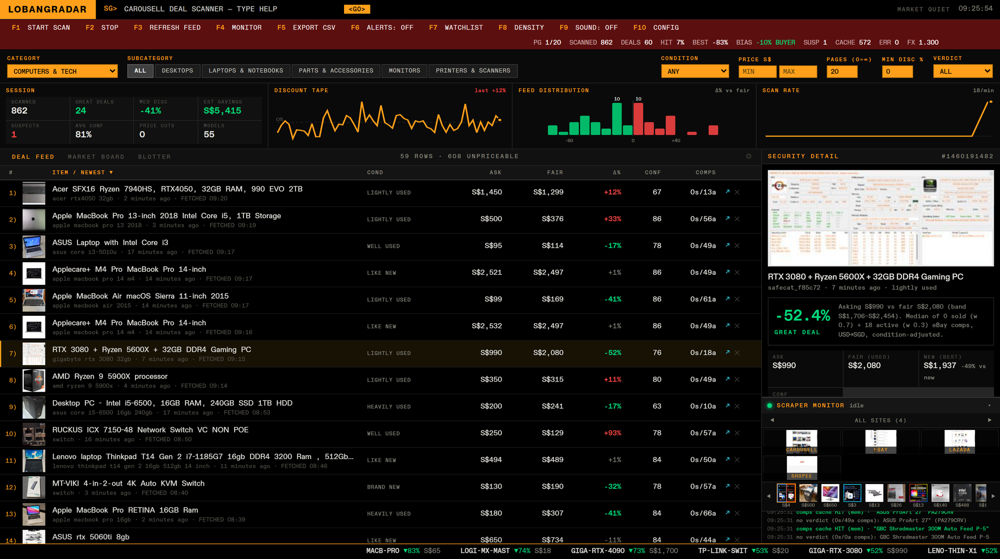
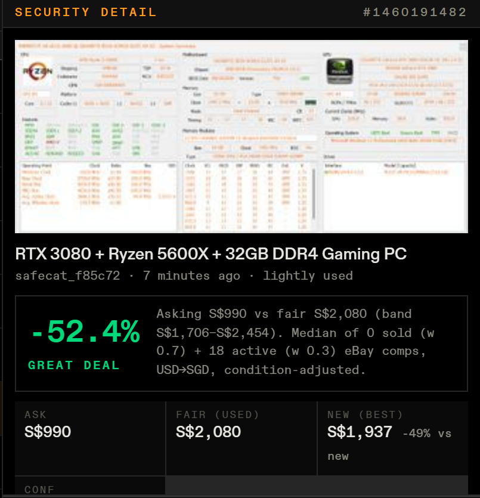
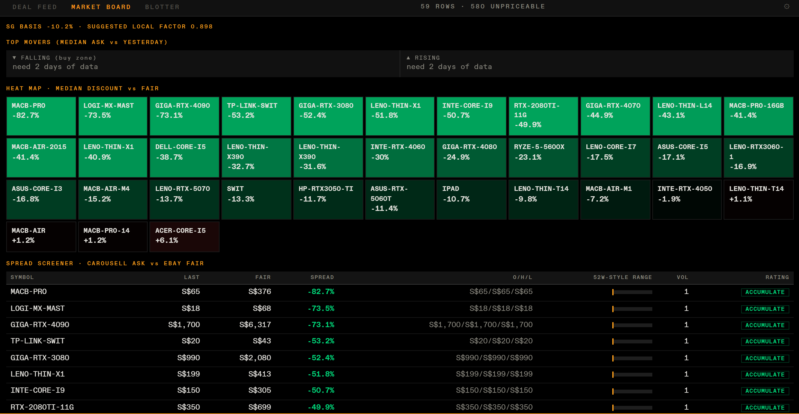
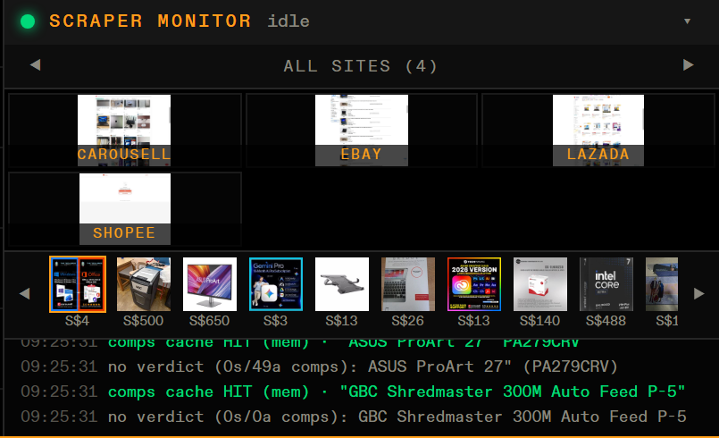
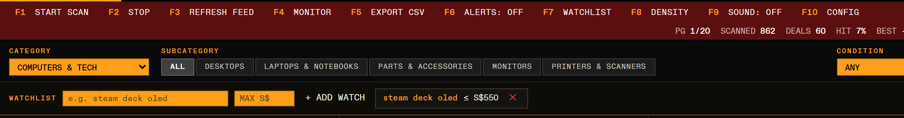

# LobangRadar

> *lobang* (Singlish): a good deal. **A Bloomberg-terminal-style market scanner for second-hand electronics in Singapore.**


---

## Overview

LobangRadar continuously sweeps C2C marketplace listings, prices every item against
international sold/active comparables and local brand-new retail prices, and streams
buy/hold/avoid verdicts into a live trading-terminal UI. It turns a slow, manual
"is this a good deal?" search into a real-time market feed — complete with a ticker
tape, per-model analytics, watchlist fills, and scam detection.

**Use case:** consumer deal discovery and price intelligence for the resale
electronics market; the same engine generalises to any C2C marketplace vertical.

---

## System Architecture

```
┌────────────┐   scrape    ┌──────────────┐   comps    ┌──────────────┐
│ Marketplace│ ──────────► │  Pricing     │ ─────────► │  Comparables │
│  listings  │  (tiered    │  pipeline    │  (parallel │  sold/active │
│  (SSR/SPA) │   fetchers) │  + verdicts  │   fan-out) │  + MSRP refs │
└────────────┘             └──────┬───────┘            └──────────────┘
                                  │ SSE / REST
                           ┌──────▼───────┐
                           │ Terminal UI  │  live feed · market board ·
                           │ (vanilla JS) │  blotter · embedded scraper views
                           └──────────────┘
```

| Layer | Technology | Role |
|---|---|---|
| Backend | **Python 3.12 · FastAPI (async)** | Scan orchestration, pricing engine, REST + SSE APIs |
| Acquisition | **curl_cffi · Patchright (stealth Chromium)** | Tiered fetching with TLS impersonation, one isolated tab per source site, adaptive per-host throttling |
| Data | **SQLite (WAL) + in-process caches** | Deals, comps price history, watchlists, learned match blocklist |
| Frontend | **Vanilla JS · CSS · SVG** | Zero-framework terminal UI: live charts, sortable feed, command line with `<GO>` navigation |
| Streaming | **Server-Sent Events + MJPEG** | Deal/alert push, embedded live views of every scraper tab |
| Quality | **pytest (42 fixture-based tests) · ruff · GitHub Actions** | Offline test suite, lint gate, scheduled live-parser canary |
| Packaging | **Docker** | Headless container mode |

---

## Feature Showcase

### Main Terminal

*Full desktop view: session analytics strip, live charts, numbered deal feed, security-style detail panel, embedded scraper monitor and scrolling market tape.*

### Deal Detail & Fair-Value Verdict

*The SECURITY DETAIL panel: listing photo, condition-adjusted fair-value band, % vs market verdict, and brand-new price reference — here a gaming PC flagged 52.4% under fair value.*

### Market Board

*The MARKET BOARD tab: top movers vs yesterday, discount heat map, and a spread screener with session O/H/L, range bars and analyst-style ratings per model.*

### Live Scraper Monitor

*The scraper dock: one labelled live view per source site, a thumbnail ticker of scraped listings, and the event log.*

### Watchlist & Alerts

*The watchlist bar with an active hunt (`steam deck oled ≤ S$550`). Every scanned listing is checked against saved watches; hits fire a desktop alert and land in the BLOTTER tab.*

### Command Line

*The header command line mid-command (`SCAN laptops + monitors`) with the `<GO>` key.*

---

## Core Features

1. **Condition-adjusted fair pricing** — every listing is canonicalised (brand,
   model, generation, spec) and priced against recency-weighted sold and active
   comparables with outlier trimming, currency normalisation and per-condition
   adjustment; extreme or low-specificity matches are automatically suppressed
   rather than shown as false verdicts.
2. **Market-terminal UX** — Bloomberg-inspired interaction model: numbered rows
   navigable by `N <GO>`, a real command line (`SCAN`, `RUN <preset>`, symbol
   lookups), sortable columns, keyboard row navigation, density toggle, saved
   layouts and a scrolling price tape.
3. **Transparent, self-correcting engine** — every verdict ships with its
   comparables, confidence score and reasoning; a one-click *wrong match* control
   feeds a persistent blocklist the scanner honours on all future listings, and a
   built-in backtest endpoint scores historical fair values against later sales.
4. **Resilient acquisition layer** — per-site browser isolation, adaptive
   backoff on challenges, layered result caching, retry queues, page-level change
   detection and a sweep-then-monitor loop that keeps polling for brand-new
   listings until stopped.
5. **Buyer protection signals** — scam heuristics (too-good pricing,
   off-platform contact bait, fresh seller accounts) flag suspect listings with
   explicit reasons instead of celebrating them as deals.

---

## License

This is a public showcase repository — it contains the project README and
feature screenshots only. The source code is private; access can be arranged
on request for portfolio review. All rights reserved.

*Personal-use tool: it politely scrapes publicly visible pages (throttled,
cached, listing-triggered). Respect the target sites' terms of service.*
